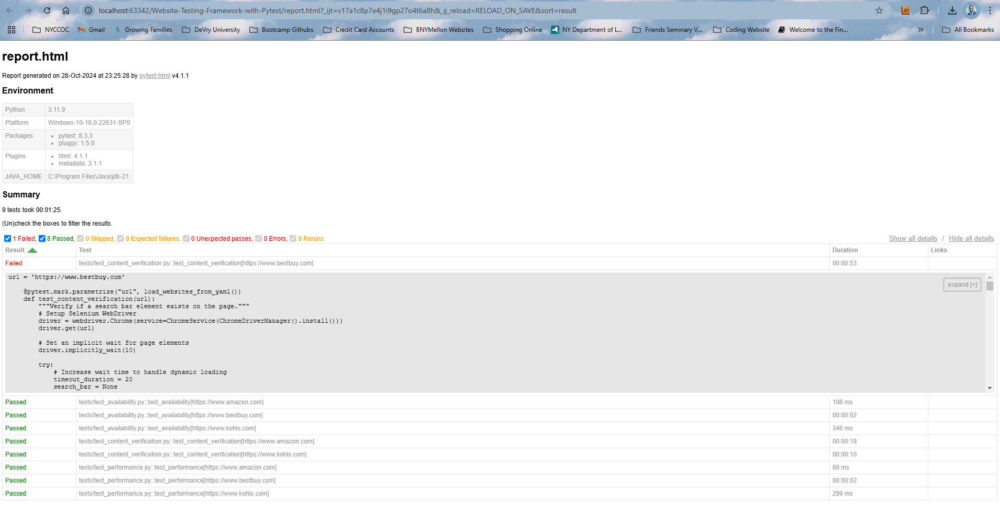

# Website-Testing-Framework-with-Pytest
This project is a Pytest-based framework for automated testing of multiple retail websites. It performs daily tests to verify the **availability**, **performance**, and **content** of selected sites and generates a report on GitHub. The framework uses Selenium for browser-based testing, and Pytest to organize and run tests, with reports generated in HTML format.

## Project Structure

```
.
├── tests
│   ├── test_availability.py           # Tests if each website is available and accessible.
│   ├── test_content_verification.py   # Checks if a search bar element is present on the homepage.
│   ├── test_performance.py            # Measures page load time for each website.
├── helpers.py                         # Contains utility functions, including YAML loader.
├── websites.yaml                      # YAML file listing websites to test.
├── requirements.txt                   # List of project dependencies.
└── README.md                          # Project documentation.
```


## Requirements

Ensure you have the following dependencies installed:

- `pytest`
- `selenium`
- `webdriver_manager`
- `PyYAML`
- `pytest-html`
- `seleneium`
- `webdriver_manager`
- `beautifulsoup4`
- `requests`

Install the dependencies using:

```bash
pip install -r requirements.txt
```

## Configuration

Update the `websites.yaml` file to add or remove websites to be tested. Example format:

```yaml
websites:
  - https://www.amazon.com
  - https://www.bestbuy.com
  - https://www.kohls.com
```

## Tests

1. **Availability Test**: Checks if the website loads successfully (HTTP 200).
2. **Content Verification Test**: Verifies if a search bar is present on the homepage of each site.
3. **Performance Test**: Measures page load time and checks if it is within acceptable limits.

### Running Tests

Run all tests with the following command:

```bash
pytest --html=report.html --self-contained-html
```

### Individual Tests

To run a specific test, use:

```bash
pytest tests/test_availability.py
pytest tests/test_content_verification.py
pytest tests/test_performance.py
```

### Test Reports

An HTML report (`report.html`) will be generated in the root directory. Open it in your browser to view the detailed results.


## Helpers

The `helpers.py` file contains utility functions, including a YAML loader function to fetch URLs from `websites.yaml`.

### Notes

- For best results, ensure a stable internet connection.
- Some websites may dynamically load content, which could affect the `Content Verification Test`. This test includes fallback patterns to handle dynamic loading for common sites.

## Contributing

If you want to contribute or enhance functionality, feel free to submit pull requests.